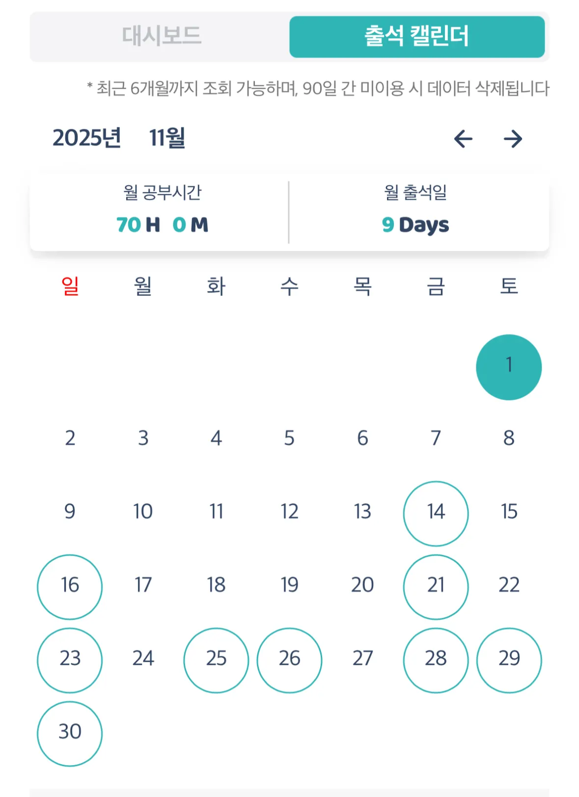
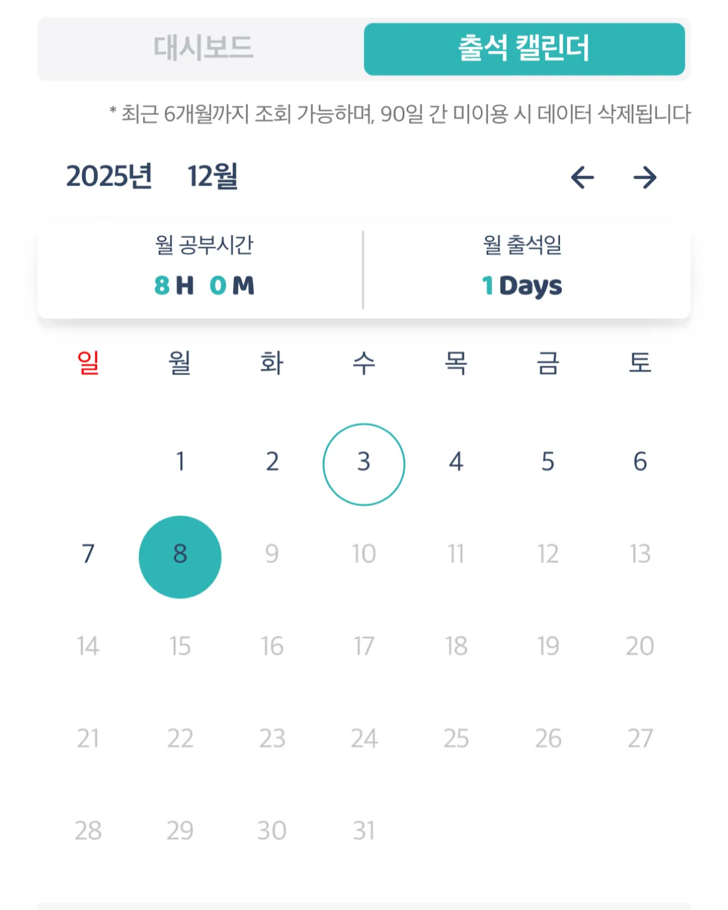

올해 JLPT N2, N1 시험을 모두 쳤지만, N2는 상반기의 일이다 보니 잘 기억나지 않고, N2도 열심히 하긴 했지만 N1 준비는 출근 전, 퇴근 후, 주말 시간을 쪼개 가며 열심히 했기에 회고를 작성해보려 한다.

## JLPT 준비를 결심하게 된 계기

고등학교, 대학생 때 해외 살이에 대한 로망이 있었고, 그 당시엔 미국에 가서 살고 싶었다. 그러나, 솔직히 말하면 해외살이에 대한 열망이 그렇게 크지 않았고, 눈 앞의 다른 일들을 하느라 대부분의 시간 잊고 살던 로망이었다. 그저 가끔 떠오르는 정도였달까.

그러나, 30대에 조금씩 가까워지면서 내 꿈과 목표에 대해 생각하는 시간과 횟수가 늘어나며, 구석에 짱박아 둔 해외살이라는 목표는 지금 아니면 이루기 점점 어려워질 것이라고 느꼈다. 그래서, 가족들과의 거리가 멀지 않은 나라이며 내가 좋아하는 J-Pop, 일본 애니를 즐길 수 있는 **일본에서 일하는 것**을 목표로 하게 되었다.

> 올해 5월에 후쿠오카로 <스파이에어>라는 밴드의 공연을 보러 다녀온 적도 있다.
{: .prompt-info }

일본에서 일하기 위해서는 이력서, 포트폴리오, 면접을 준비하는 것도 중요하지만, 일단은 **“언어”**가 되어야 한다고 생각했다. 그래서 작년 말에 아래와 같은 목표를 세웠었다.

- JLPT N2, N1 고득점 합격
- 회화 실력 향상

일본어 회화의 경우엔, 일상생활에서 내 의사를 표현하는 정도는 할 수 있었지만, 정확한 문법 사용이나 문장을 길게 이어가는 것에는 미흡했기 때문에 회화 실력 향상을 위한 목표를 잡았다. 이에 대한 자세한 내용은 2025년도 회고글에서 다룬다.

정리하자면, **“일본에서 일하기"**라는 목표를 위해 작년 JLPT N3를 시작으로 올해 JLPT N2, N1을 준비했다.

 

## JLPT N1 준비 과정

작년 N3를 준비할 때에도 학원을 다녔었기 때문에 N2와 N1도 학원을 등록했다(돈만큼 의지를 다져주는 게 있을까). N3는 강남에 있는 학원을 다녔지만, N2와 N1은 좀 더 집과 가까운 **신촌 시사일본어 주말반 수업을 수강**했다.

주말반 수업은 오전 10시부터 2시(시험 2달 전부터는 3시)까지이다. 교재는 자체교재로 문자/어휘, 문법, 독해, 청해 파트로 구성되어 있다. JLPT N3부터 N1까지의 학원 이력을 정리해보면 아래와 같다.

| 기간              | 내용                        |
|-----------------|---------------------------|
| 2004년 10월 ~ 11월 | 강남 일본어학원 (JLPT N3 주말반)    |
| 2024년 12월       | JLPT N3 시험 응시 (118점으로 합격) | 
| 2025년 1월 ~ 6월   | 신촌 시사일본어 학원 (JLPT N2 주말반) |
| 2025년 7월        | JLPT N2 시험 응시 (145점으로 합격) | 
| 2025년 8월 ~ 11월  | 신촌 시사일본어 학원 (JLPT N1 주말반) |
| 2025년 12월       | JLPT N1 시험 응시 (결과발표 전)    | 

> 신촌 시사일본어 학원을 거진 1년 다니며 JLPT반, 회화반을 수강했는데 수업 커리큘럼, 선생님의 실력 등 다방면으로 너무나도 만족했기 때문에 일본어를 배울 예정이라면 신촌 시사일본어 학원을 추천한다.
{: .prompt-tip }

### 공부 범위

학원 수업을 한 번도 빠지지 않고 열심히 들었고, 숙제도 빠짐없이 해갔다. 다만, 수업 듣고 숙제만 한다고 해서 절대 실력이 늘지 않기 때문에 학원 숙제에 더해 “**복습”**을 정말 중요하게 생각했다. 해당 주의 진도 나간 부분을 복습할 때 틀린 문제 오답 뿐만 아니라 모르는 단어나 문법이 있다면 작은 휴대용 노트에 정리해서 시간 짬날 때마다 외웠다.

{: w="400"}

그리고 주말반이다 보니 주 1회 수업만으로는 시간이 충분하지 않고, 단기간 공부해 고득점을 할 수 있는 영역이 문자/어휘, 문법, 독해이다 보니 청해는 수업 시간에 비중 있게 다루진 않는다(주말반은 격주로 월 2회 청해 진도를 나갔다). 그래서 따로 청해 문제집을 구매했고, “매일 최소 30분은 일본어를 듣자”란 생각으로 청해 문제집을 매일 조금씩 풀어나갔다.

마지막으로, 시험 2주 전 학원의 모의고사 특강에서 모의고사 1회분(청해 제외)를 실제 시험 치듯 시간 내 풀어봤었다. 그런데, 이때 시간 배분을 제대로 못했어서 따로 시간 배분하는 연습을 하지 않으면 큰일이라는 생각이 들어 실전 모의고사 문제집을 사서 추가로 1회분을 풀었다.

> 정확한 시간 계산을 위해 쿠팡에서 아날로그 시계도 샀는데 시험 때 굉장히 유용하게 잘 썼다. 시험 보기 전 학원에서든 개인적으로든 모의고사를 최소 1번 시험 시간에 맞춰 풀어보면서 시간 배분 연습하는 걸 추천한다.
{: .prompt-tip }

요약하자면, 내가 공부한 분량은 아래와 같다.
- 학원 수업 및 특강(족집게, 모의고사) 듣기
- 학원 수업 복습 + 숙제
- 청해 문제집 1권 풀기
- 실전 모의고사 문제집 1회분 풀기
- 휴대용 노트(문법/어휘) 4개 돌아가며 암기

{: w="600"}

> 우측의 학원 교재에는 문제만 실려 있기 때문에 문법/단어/기출문제 등의 프린트물로도 진도를 나갔고, 단어 프린트물은 매주 1페이지씩 외워 단어 시험을 쳤다.
{: .prompt-info }

### 공부 시간

기본적으로 출근 전 1시간, 점심시간 1시간으로 매일 2시간은 확보하려고 노력했다. 퇴근 후엔 운동이나 회식, 약속 등으로 인해 공부할 수 있는 날이 많지 않았지만 금요일은 예외적으로 토요일 수업 때문에 반강제적으로 남은 숙제를 하느라 4시간 정도 공부했다. 그래서 금요일 약속이 있는 날에는 저녁 10시 정도에 집에 돌아와서 새벽 2시까지 공부했던 기억이 난다. 그리고 주말엔 학원 수업, 약속을 제외한 나머지 시간에 짬을 내 공부했다.

시험 3주 전부터는 발등이 활활🔥 불타고 있었기 때문에 불가피한 약속이 아니면 최대한 12월 시험 이후로 날짜를 잡았고, 회사 외 개인 시간은 모두 일본어 공부에 쏟기 위해 독서실에 다니기 시작했다. 평일에 퇴근 후 일정이 없는 날은 독서실에 가서 2~3시간씩 공부했고, 일요일에는 하루 종일 독서실에 박혀 있었다. 그리고 시험 2주 전부터는 오후 반차랑 연차를 사용해 공부 시간을 더 확보했다.

앉아서 공부한 시간 외에 이동할 때나 자기 전에 단어/문법을 암기한 시간, 독서실 가기엔 시간이 애매해 집에서 중간중간 공부한 시간까지 더해 계산해보면 **시험 3주 전까진 주 18시간** 정도, **시험 3주 전부터 시험까지는 주 32시간** 정도 일본어 공부에 투자했다. 추가로, 공부 시간 확보와 긴장감 유지를 위해 수면 시간도 평일/주말 상관없이 7시간으로 유지했다. 고등학생, 대학생 때도 이렇게 열심히 살았나 싶을 정도로 치열하게 공부한 기간이었다.

  
  

> 내 목표는 N1 “고득점” 합격이었기 때문에 공부 시간을 위와 같이 가져갔지만, 성적 상관없이 합격만 하면 되는 경우엔 주 18시간 정도면 충분하지 않을까 싶다.
{: .prompt-tip }

### D-Day 카운트

공부를 하다 보면 가끔 해이해질 때가 있어 좀 더 경각심을 가지기 위해 시험까지의 D-Day와 해당 월의 목표를 적은 칠판을 현관에 붙여두었다. 매일 아침 정신 차리자는 생각으로 D-Day를 고쳐 적었다. 조금 도움이 된 것 같기도…?

{: w="400"}

 

## JLPT N1 난이도

이번 JLPT N1 시험에 대한 느낀점을 적어보자면, 확실히 시간 배분 연습을 해서 그런지 문제 푸는 시간이 부족하진 않았다. 합격은 할 것 같은데 과연 160점 이상의 점수가 나올지가 관건일 것 같다.

### 언어지식(문자/어휘/문법)

문자/어휘에서는 시험 전날 학원에서 푼 기출 문제에서 한 두 개 비슷한 단어가 나와서 기뻤지만 한편으로는 처음 보는 단어들도 꽤 있어서 찍을 수밖에 없었던 문제들 때문에 슬프기도 했다😊😢.

문법은 난이도가 크게 높았던 것 같지 않았다. 킬러문제 1~2 문제를 제외하곤 평이했고, 경어 문제가 나오지 않았어서 다행이라고 생각했다(경어도 외우긴 했지만 어려워🤯).

### 독해

독해는 아리까리한 2개 지문 제외하고는 술술 읽힌 편이었는데, 어휘량이 받쳐준 것도 있겠지만 문법을 한 번 제대로 잡은 게 크다고 느꼈다. N2든 N1이든 선생님들이 공통적으로 말씀하셨던 게 문법이 받쳐줘야 정확한 독해가 가능하다는 것이었는데, 문법이 머릿속에 박혀 있는 상태에서 독해 지문을 읽으니 얼렁뚱땅 때려맞추면서 해석하는 빈도가 많이 줄었다.

### 청해

청해도 마찬가지로 문법이 잡혀 있어서 그런지 크게 어려웠던 것 같지 않다. 특히 즉시응답 문제에서는 문법이 많이 들어가는데, 정확한 선지 선택을 위해선 문법을 알아야 정답률을 높일 수 있다.

 

## 회고

JLPT N1을 준비했던 이 긴긴 4개월… 몇 년 동안 내가 이렇게 열중해본 것이 있었나 싶을 정도로 온 힘을 다해 공부한 시험 전 3주. 뿌듯하기도 하고 대견하기도 하고 아쉽기도 하다. 추가로 TMI를 몇 가지 더 풀자면,

- 최대한 일본어를 접하는 시간을 늘리고 싶어서 밥 먹을 때나 휴식할 때에도 한국 예능이나 드라마를 보지 않고 일드를 보려고 노력했다. 원래는 일드를 안 봤는데, &lt;도망치는 건 부끄럽지만 도움이 된다&gt;를 보고 너무 재밌어서 이후엔 자발적으로 일드를 찾아 보게 되었다. 올해 하반기에만 본 드라마가 방금 적은 드라마와 &lt;Hot Spot&gt;, &lt;만능사원 오오마에&gt;, &lt;언 내추럴&gt;. 그리고 지금 보고 있는 건 &lt;조금만 초능력자&gt;.
- 시험 전 긴장을 많이 했는지, 시험 3일 전부턴 입맛이 뚝 떨어져서 다이어트 도시락 한 개를 하루 동안 두 번에 나눠서 억지로 먹을 정도였다. 이 세상의 모든 식욕이 사라진 느낌?(다이어트까지 시켜주는 JLPT)

시험을 이후엔 밀린 약속들, 여행 등으로 정신없이 12월을 보낸 것 같다. 결과가 나오기까진 1달 남았는데 고득점 할 수 있으면 좋겠다. 그리고 쌓아올린 독해 능력을 잃지 않기 위해 &lt;스즈메의 문단속&gt; 일본어 원서를 읽고 있는데, 모르는 단어들은 중간중간 사전 찾아봐야 하지만 어휘량, 읽는 속도, 해석 능력이 정말 많이 발전했구나 싶다.

{: w="300" style="border: 1px solid #e0e0e0; border-radius: 6px; display: block; margin: 0 auto;"}

